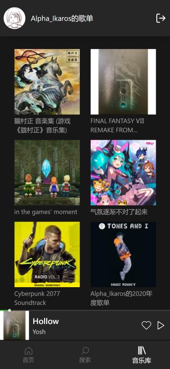
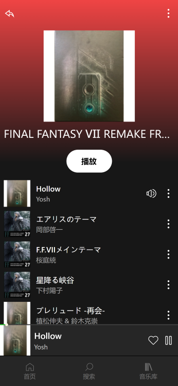
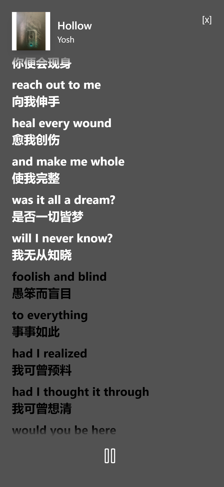

# Musicease - 网易云手机PWA网页

## 👯‍♂️ 适用人群

旧手机，~~老年机~~带不动一大堆APP，或是因为官方APP内容太杂只想专注于听音乐。

> 手机食用，效果更佳 [🎶访问DEMO](https://aoiyukizakura.github.io/music-ease)

## 🎉 感谢

- [Binaryify/NeteaseCloudMusicApi](https://github.com/Binaryify/NeteaseCloudMusicApi) 提供的后端api服务
- [qier222/YesPlayMusic](https://github.com/qier222/YesPlayMusic) 的前车之鉴以及灵感启发
- [Spotify](https://www.spotify.com)
- [网易云音乐](https://music.163.com)

## ✨ 特性

- 👑 使用vue3 + vite2.0 + typescript开发
- 🔑 支持网易云账号登录（邮箱/手机号）
- 📑 支持滚动歌词
- 📲 支持PWA
- 📀 除去所有杂项，只存在听歌功能（真的只有听歌功能）
- 🎨 页面简(jian)洁(lou)

## 🖥 本地开发环境

由于项目不包含后端服务，所以后端的具体部署与配置，请移步[此处](https://github.com/Binaryify/NeteaseCloudMusicApi)

```sh
  # 克隆本仓库
  git clone https://github.com/aoiyukizakura/music-ease.git
  # 进入目录
  cd music-ease
  # 安装依赖
  npm install
  # 运行项目
  npm run dev
```

## 📦 打包部署

1. 复制环境配置文件

```ps
cp .env.example .env.local
```

2. 配置环境变量

```sh
VITE_BASE_URL = '{your URL}'
VITE_REAL_IP = '{whatever ipv4 address}'
```

3. 打包

```sh
npm run build
```

4. 将打包好的文件夹上传到你的服务器

```sh
scp -P <port> -r dist {username}@{ip}:{dir_location}
```

## 📜 开源许可

本项目仅供个人学习研究使用，禁止用于商业及非法用途。

## 🎞 截图展示

<br>



<br>
